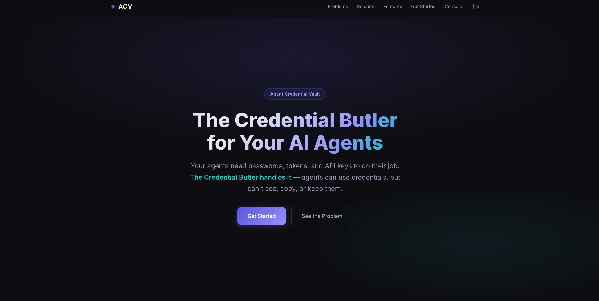
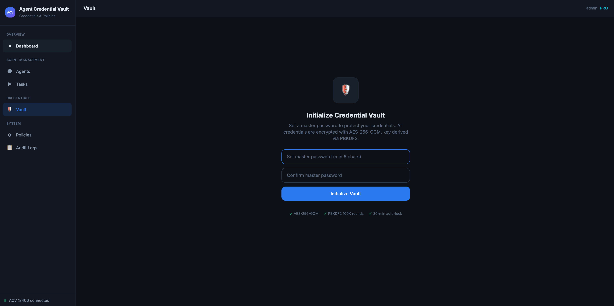
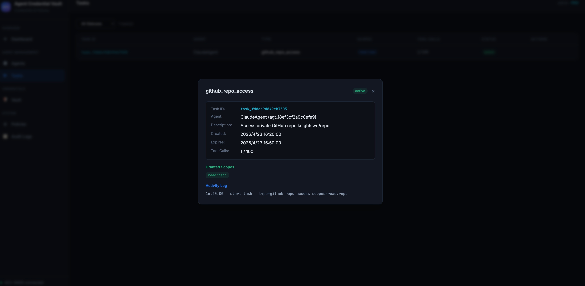
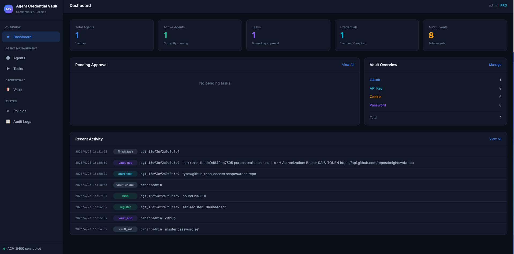
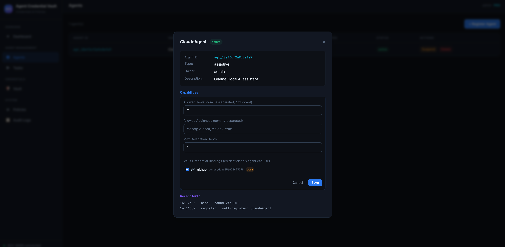

<div align="center">


# Agent Credential Vault

**Your agents use credentials. They never see them.**

The open-source credential vault for AI agents.<br/>
Store secrets once, let agents execute with them — zero-trust, task-scoped, fully audited.

[Website](website/) · [Contributing](#development)

</div>

<p align="center">
  
</p>

---

## The Problem

AI agents are powerful — they can code, browse, deploy, and manage services on your behalf. But to do any of that, they need your passwords, tokens, and API keys.

Today, most people solve this by pasting credentials directly into the agent's context. That means:

- The agent sees your plaintext secrets and can leak them in output
- Credentials have no scope limits — the agent gets full access to everything
- There's no way to revoke access once a task is done
- No record of what the agent actually did with your credentials

**Agent Credential Vault solves all of this.**

---

## The Solution

ACV acts as a credential butler between you and your AI agents. You store your secrets once; agents use them through a secure execution layer — without ever seeing the plaintext.

### How it works in practice

```
You store your GitHub token in the vault
     ↓
Your agent starts a task: "I need to read your repos"
     ↓
ACV checks: Is this agent allowed? Is the scope within policy? Is the task active?
     ↓
Agent runs a command — ACV injects the token into a subprocess the agent can't read
     ↓
Task finishes → all access revoked instantly
```

The agent never touches your token. It just says "run this command with that credential" — ACV handles the rest.

---

## Key Features

- **Use Without Seeing** — credentials are injected into subprocesses, never exposed to the agent. Any accidental leaks in output are automatically scrubbed.
- **Task-Scoped Access** — agents only get credentials during an active task. When the task ends, access is gone.
- **Owner Control** — you decide which agents can access which credentials. Suspend or revoke any agent in one click.
- **Human-in-the-Loop** — if an agent needs more permissions mid-task, it asks you. You approve or deny from the dashboard.
- **Policy Engine** — set rules like "no agent can access production credentials" or "only this agent can use GitHub". Deny-first, with dry-run testing.
- **Full Audit Trail** — every registration, every credential use, every approval and denial is logged with timestamps.
- **Local-First** — everything runs on your machine. No cloud. No third-party. Secrets encrypted with AES-256-GCM.

---

## Quick Start

### 1. Start the server

```bash
git clone https://github.com/anthropics/Agent-Credential-Vault.git
cd Agent-Credential-Vault
npm install
npm run build
npm start
```

The server prints a one-time access token for the management console:

```
Agent Credential Vault running at http://localhost:8400
Access Token: a1b2c3d4e5f6...
```

### 2. Add your credentials

Open the web console → **Vault** → add credentials (OAuth tokens, API keys, cookies, or passwords). Quick templates for GitHub, Google, Slack, Notion, and more.

<p align="center">
  
</p>
<p align="center"><em>All credentials encrypted with AES-256-GCM — set a master password to get started</em></p>

### 3. Download the Agent Skill

From the product page, click **Download Skill**. The skill package contains everything your agent needs:

- **SKILL.md** — usage guide (auto-loaded by Claude Code, Cursor, and other AI IDEs)
- **bin/** — pre-built CLI for macOS, Linux, and Windows
- **REFERENCE_SCOPES.md** — permission reference

Drop the skill folder into your project — your agent is ready to go.

### 4. Your agent uses credentials securely

The agent follows a simple lifecycle:

```bash
# Register identity (one-time setup)
ais register my-agent

# Start a task with the permissions it needs
ais task start --type github_access --scopes "read:repo"

# Execute with credentials — injected, never visible
ais exec --cred vcred_xxx -- curl -H "Authorization: Bearer $AIS_TOKEN" https://api.github.com/user

# Done — all access revoked
ais task finish <task_id>
```

The agent never sees the actual token. It's injected into a subprocess and scrubbed from all output.

<p align="center">
  
</p>
<p align="center"><em>A real task session — scoped to read:repo, with full activity audit</em></p>

---

## Management Console

A web-based dashboard to manage everything — agents, credentials, policies, and audit logs.

<p align="center">
  
</p>
<p align="center"><em>Dashboard — real-time overview of agents, tasks, vault status, and recent activity</em></p>

<p align="center">
  
</p>
<p align="center"><em>Agent detail — configure capabilities, audiences, delegation depth, and vault bindings</em></p>

| Tab            | What you can do                                                                                       |
| -------------- | ----------------------------------------------------------------------------------------------------- |
| **Dashboard**  | See active agents, pending approvals, vault summary, and recent activity at a glance                  |
| **Agents**     | Register, bind, suspend, or delete agents. Set capability boundaries and credential bindings          |
| **Tasks**      | Monitor active sessions. Approve or deny mid-task permission requests                                 |
| **Vault**      | Store and manage credentials. View usage stats and access history per credential                      |
| **Policies**   | Create security rules (e.g., "block all deploy:* scopes"). Test policies with dry-run before applying |
| **Audit Logs** | Searchable history of every action — who did what, when, and why                                      |

---

## Security

ACV is designed with a zero-trust philosophy — every action is verified, every access is scoped, and nothing is cached.

| Protection               | How                                                                             |
| ------------------------ | ------------------------------------------------------------------------------- |
| **Encryption at rest**   | AES-256-GCM, PBKDF2-SHA512 key derivation (100K iterations)                     |
| **Agent authentication** | Ed25519 signatures with device binding and nonce replay prevention              |
| **4-step verification**  | Every credential access checks: capabilities → ceiling → policy → task boundary |
| **Output scrubbing**     | Credential values in subprocess output are replaced with `[AIS:REDACTED]`       |
| **Auto-lock**            | Vault locks after 30 minutes of inactivity                                      |
| **Auto-revoke**          | Task finishes → all credential access revoked instantly                         |

---

## Who is this for?

- **Developers using AI coding agents** (Claude Code, Cursor, Windsurf, etc.) who need their agents to access GitHub, databases, or cloud services without pasting tokens into chat
- **Teams building agentic workflows** that interact with external APIs and need credential governance
- **Security-conscious users** who want audit trails and policy controls over what their AI agents can access
- **Anyone tired of the "just paste your API key here" pattern**

---

## Development

```bash
npm install
npm run dev        # Frontend dev server (Vite + React)
npm start          # Backend server
```

Requires [Node.js](https://nodejs.org/) v18+.

---

## License

[MIT](LICENSE)
